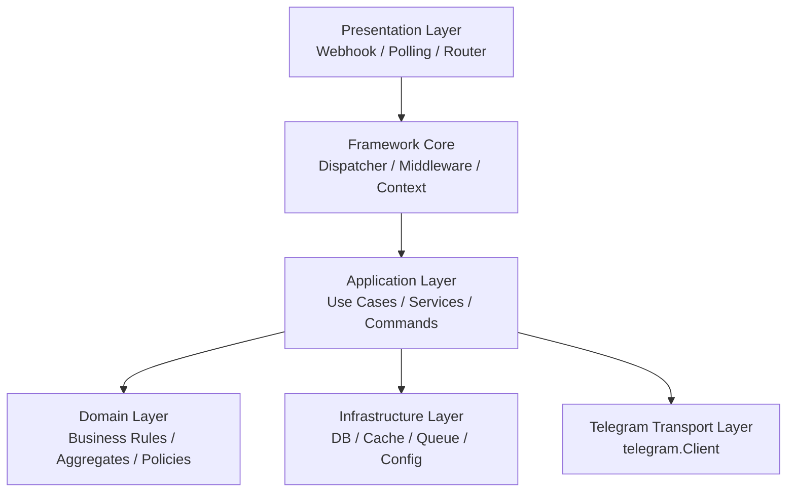
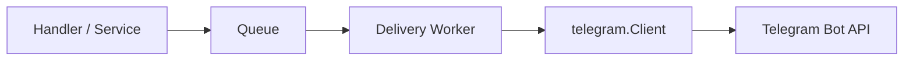

# Telegram Bot Framework Architecture

> Documentation style: GitHub Flavored Markdown  
> Intended for repositories published on GitHub and compatible with MIT-licensed projects.

## 1. Mục tiêu kiến trúc

Framework này hướng tới 3 mục tiêu:

1. **Tách lớp rõ ràng** giữa Telegram transport và business logic.
2. **Dễ mở rộng** từ notification sender sang full interactive bot.
3. **Production-ready** về retry, state, observability, testability.

## 2. Phạm vi hiện tại và phạm vi framework đầy đủ

### 2.1 Đã có trong code hiện tại

Repository hiện đã có một package outbound hoàn chỉnh:

- constructor và options
- content model
- multipart upload
- retry + backoff
- rate-limit awareness
- batch sending
- keyboard model
- response/error typing

Các file chính:

- [client.go](../client.go)
- [config.go](../config.go)
- [options.go](../options.go)
- [content.go](../content.go)
- [keyboard.go](../keyboard.go)
- [types.go](../types.go)
- [error.go](../error.go)
- [internal/utils/http.go](../internal/utils/http.go)

### 2.2 Chưa có nhưng nên thuộc full framework

- webhook adapter
- polling adapter
- update model
- dispatcher/router
- middleware chain
- command handler
- callback query handler
- session/state store
- job queue integration
- message editing/deleting APIs

Tài liệu này định nghĩa kiến trúc để triển khai phần còn thiếu đó.

## 3. Kiến trúc phân lớp



## 4. Nguyên tắc thiết kế

### 4.1 Dependency direction

- domain không phụ thuộc Telegram
- application biết interface outbound, không phụ thuộc transport implementation cụ thể
- infrastructure implement các interface đó
- framework core chỉ orchestration, không chứa business rule

### 4.2 Single responsibility

- transport chỉ gửi/nhận Telegram payload
- dispatcher chỉ route
- middleware chỉ cross-cutting concerns
- handler chỉ xử lý một intent/update type

### 4.3 Explicit boundaries

Mỗi boundary nên có interface rõ:

- update source
- sender
- storage
- session store
- logger/metrics

## 5. Kiến trúc module đề xuất

### 5.1 Cấu trúc thư mục khuyến nghị

```text
telegram/
├── client.go
├── config.go
├── content.go
├── options.go
├── types.go
├── keyboard.go
├── error.go
├── internal/
│   └── http.go
├── inbound/
│   ├── update.go
│   ├── webhook.go
│   └── polling.go
├── framework/
│   ├── dispatcher.go
│   ├── context.go
│   ├── middleware.go
│   ├── router.go
│   └── recovery.go
├── handlers/
│   ├── command.go
│   ├── callback.go
│   └── message.go
├── session/
│   ├── store.go
│   └── state.go
├── examples/
├── docs/
│   ├── FLOW.md
│   └── ARCHITECTURE.md
└── go.mod
```

### 5.2 Giải thích vai trò từng module

- `telegram/`: outbound client layer.
- `inbound/`: nhận update từ Telegram.
- `framework/`: glue layer cho routing, middleware, execution context.
- `handlers/`: tập hợp interface và base helper cho handler.
- `session/`: quản lý state hội thoại.
- `docs/`: design docs, ADR, operational guide.

## 6. Core contracts nên có

### 6.1 Sender interface

```go
type Sender interface {
    Send(ctx context.Context, to string, content telegram.Content) error
    SendChat(ctx context.Context, chatID int64, content telegram.Content) error
    SendMessage(ctx context.Context, to string, content telegram.Content) (*telegram.Message, error)
    SendChatMessage(ctx context.Context, chatID int64, content telegram.Content) (*telegram.Message, error)
}
```

Mục đích:

- application layer chỉ biết `Sender`
- dễ mock khi test
- dễ thay transport sau này

### 6.2 UpdateSource interface

```go
type UpdateSource interface {
    Start(ctx context.Context, handler UpdateHandler) error
}
```

Nguồn update có thể là:

- webhook HTTP server
- long polling loop

### 6.3 UpdateHandler interface

```go
type UpdateHandler interface {
    HandleUpdate(ctx context.Context, upd Update) error
}
```

### 6.4 SessionStore interface

```go
type SessionStore interface {
    Load(ctx context.Context, chatID int64) (*Session, error)
    Save(ctx context.Context, s *Session) error
    Delete(ctx context.Context, chatID int64) error
}
```

## 7. Runtime components

## 7.1 Outbound transport

Đây là phần đã có trong code hiện tại.

Vai trò:

- đóng gói Telegram Bot API
- normalize config
- build JSON/multipart request
- retry và classify error

### 7.2 Inbound adapter

Vai trò:

- nhận update JSON
- validate nguồn nhận
- parse update
- truyền vào dispatcher

Có hai implementation:

- `WebhookAdapter`
- `PollingAdapter`

### 7.3 Dispatcher

Vai trò:

- nhận `Update`
- xác định loại event
- chạy middleware chain
- gọi handler phù hợp

Dispatcher không nên chứa:

- SQL
- business rule
- formatting response phức tạp

### 7.4 Middleware

Middleware chuẩn nên hỗ trợ:

- request logging
- panic recovery
- timeout guard
- authz/authn
- deduplication
- metrics
- tracing
- rate limiting inbound

### 7.5 Handler layer

Handler là nơi translate từ Telegram update sang use case của app.

Ví dụ:

- `/start` -> `StartCommandHandler`
- `/help` -> `HelpCommandHandler`
- `callback:approve` -> `ApproveCallbackHandler`
- text thường -> `MessageHandler`

### 7.6 Application service

Application service:

- biết business use case
- gọi DB/cache/queue
- gọi `Sender` để phản hồi

Handler nên mỏng, service nên chứa logic chính.

## 8. Update model của framework

Framework đầy đủ nên support tối thiểu:

- `message`
- `edited_message`
- `callback_query`
- `inline_query`
- `chosen_inline_result`
- `channel_post`

Cho phiên bản đầu tiên, nên implement trước:

- `message`
- `callback_query`

Lý do:

- chiếm phần lớn use case bot
- complexity thấp hơn
- đủ cho bot command + button workflow

## 9. Execution context của framework

Nên có `BotContext` riêng, không chỉ dùng `context.Context`.

Ví dụ nên chứa:

- raw `Update`
- `ChatID`
- `UserID`
- `Username`
- `MessageID`
- `Locale`
- `Session`
- `Sender`
- `Logger`

Ví dụ:

```go
type BotContext struct {
    Context  context.Context
    Update   Update
    Sender   Sender
    Session  *Session
    ChatID   int64
    UserID   int64
    Username string
}
```

Lợi ích:

- handler dễ dùng
- giảm lặp code parse update
- gom execution data vào một điểm

## 10. Router và chiến lược route

### 10.1 Route theo loại update

- `message`
- `callback_query`
- `inline_query`

### 10.2 Route theo command

- `/start`
- `/help`
- `/settings`

### 10.3 Route theo callback prefix

- `approve:123`
- `reject:123`
- `page:2`

### 10.4 Route fallback

- unknown command handler
- default message handler

## 11. Session và state machine

### 11.1 Khi nào cần session

- bot nhiều bước
- wizard form
- xác nhận thao tác
- conversational flow

### 11.2 Session model đề xuất

```go
type Session struct {
    ChatID      int64
    UserID      int64
    State       string
    Data        map[string]string
    UpdatedAt   time.Time
}
```

### 11.3 Nguyên tắc state machine

- state phải explicit
- không để logic “ngầm”
- handler đọc state hiện tại rồi decide next state
- persist state trước hoặc sau gửi reply tùy use case, nhưng phải nhất quán

## 12. Persistence architecture

### 12.1 Những gì nên lưu

- bot user registry
- `chat_id`
- mapping business user <-> Telegram user
- session/state
- outbound delivery history
- callback token / dedupe key

### 12.2 Storage options

- PostgreSQL: chuẩn production
- Redis: cache/session/rate limiter
- SQLite: local/dev hoặc single-node nhỏ

### 12.3 Best practice

- `chat_id` nên là nguồn định danh gửi tin chính
- username chỉ mang tính tham khảo
- giữ audit trail cho delivery quan trọng

## 13. Queue và async processing

### 13.1 Khi cần queue

- notification nhiều recipient
- retry dài hạn
- job fan-out
- cần tách handler latency khỏi send latency

### 13.2 Flow đề xuất



### 13.3 Quy tắc retry async

- retry transport/flood bằng job retry
- blocked/chat-not-found thì mark permanent failure
- lưu `attempt`, `last_error`, `next_retry_at`

## 14. Error model và failure policy

Error type hiện có nằm ở [error.go](../error.go).

### 14.1 Failure classes

- **Transient**:
  - network error
  - 5xx
  - flood 429
- **Permanent**:
  - invalid token
  - blocked
  - chat not found
  - forbidden

### 14.2 Policy khuyến nghị

- transient -> retry
- blocked -> disable recipient
- invalid token -> stop application startup
- forbidden -> alert + điều tra quyền bot

## 15. Security architecture

### 15.1 Token handling

- token phải lấy từ env/secret manager
- không hard-code
- không log full token
- rotate token khi nghi ngờ lộ

### 15.2 Webhook security

- HTTPS only
- validate header/token bí mật nếu dùng secret path/header
- giới hạn body size
- recovery middleware

### 15.3 Callback data security

- không tin callback data từ client là “safe”
- parse + validate
- nếu chứa ID nội bộ, phải kiểm tra quyền trước khi thao tác

## 16. Observability architecture

### 16.1 Logging

Mỗi inbound/outbound event nên log:

- update type
- command/callback
- chat ID
- user ID
- latency
- retries
- error kind

### 16.2 Metrics

- inbound update count
- outbound send count
- send failures by kind
- average send latency
- handler latency
- queue retry count

### 16.3 Tracing

Nếu dùng OpenTelemetry:

- span cho webhook/polling receive
- span cho dispatcher
- span cho each outbound API call

## 17. Testing strategy

### 17.1 Unit test

- content validation
- router matching
- callback parsing
- state transitions
- retry decision logic

### 17.2 Integration test

- `httptest` cho Telegram API mock
- webhook endpoint mock
- queue worker flow

### 17.3 Contract test

- JSON payload structure
- multipart structure
- update parsing compatibility

### 17.4 End-to-end test

- local bot sandbox
- polling mode
- command -> handler -> send response

## 18. Deployment topologies

### 18.1 Single process bot

Phù hợp:

- bot nhỏ
- internal tooling
- proof of concept

Kiến trúc:

- một binary
- webhook/polling + dispatcher + sender + DB

### 18.2 API + worker

Phù hợp:

- production notification bot
- interactive bot có nhiều send async

Kiến trúc:

- webhook receiver service
- queue
- delivery worker
- DB/Redis

### 18.3 Multi-tenant bot platform

Phù hợp:

- SaaS platform
- nhiều bot token

Cần thêm:

- token registry
- tenant isolation
- per-tenant rate limiting
- config loader theo bot

## 19. Chiến lược tích hợp với application hiện có

### 19.1 Nếu hệ thống chỉ cần gửi cảnh báo

Chỉ cần:

- package `telegram`
- service wrapper `Notifier`
- bảng lưu `chat_id`

### 19.2 Nếu hệ thống cần bot command

Cần thêm:

- inbound adapter
- dispatcher/router
- command handlers
- DB lưu user/session

### 19.3 Nếu hệ thống cần workflow phức tạp

Cần thêm:

- session state machine
- callback handlers
- queue
- observability đầy đủ

## 20. Roadmap triển khai framework

### Phase 1

- giữ nguyên outbound package hiện tại
- thêm `Update` model
- thêm `WebhookAdapter`
- thêm `Dispatcher`
- thêm command router cơ bản

### Phase 2

- thêm `PollingAdapter`
- thêm callback query support
- thêm middleware chain
- thêm `BotContext`

### Phase 3

- thêm session store
- thêm queue worker
- thêm message edit/delete/copy
- thêm metrics/tracing

### Phase 4

- distributed rate limit
- admin tooling
- tenant support
- plugin system

## 21. Kết luận kiến trúc

Thiết kế đúng nên coi framework là 2 phần:

1. **Telegram transport client**
   - phần này đã được triển khai trong repository
2. **Bot runtime framework**
   - inbound + dispatcher + middleware + handlers + state

Nếu trộn 2 phần này vào một lớp, code sẽ nhanh rối:

- khó test
- khó scale
- khó thay đổi flow hội thoại
- khó tái sử dụng cho notification-only use case

Vì vậy, hướng tốt nhất là:

- giữ `telegram.Client` mỏng và ổn định
- build framework runtime ở lớp trên
- để business logic đứng ngoài Telegram transport

## 22. Tài liệu liên quan

- Runtime flow: [FLOW.md](FLOW.md)
- Current client implementation: [client.go](../client.go)
- Telegram Bot API: <https://core.telegram.org/bots/api>
