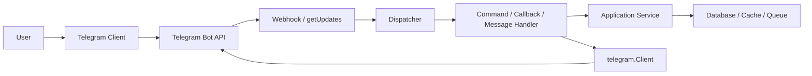
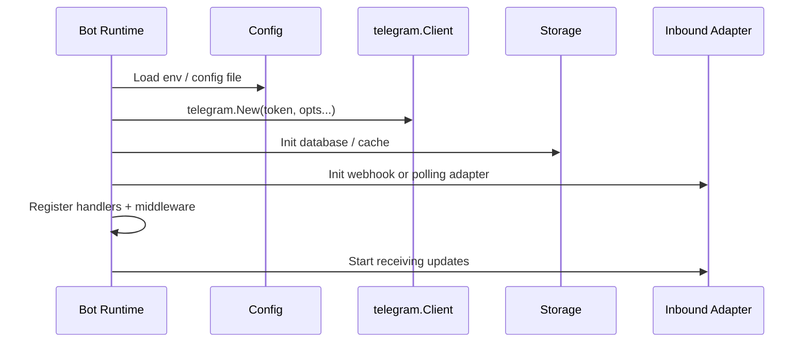
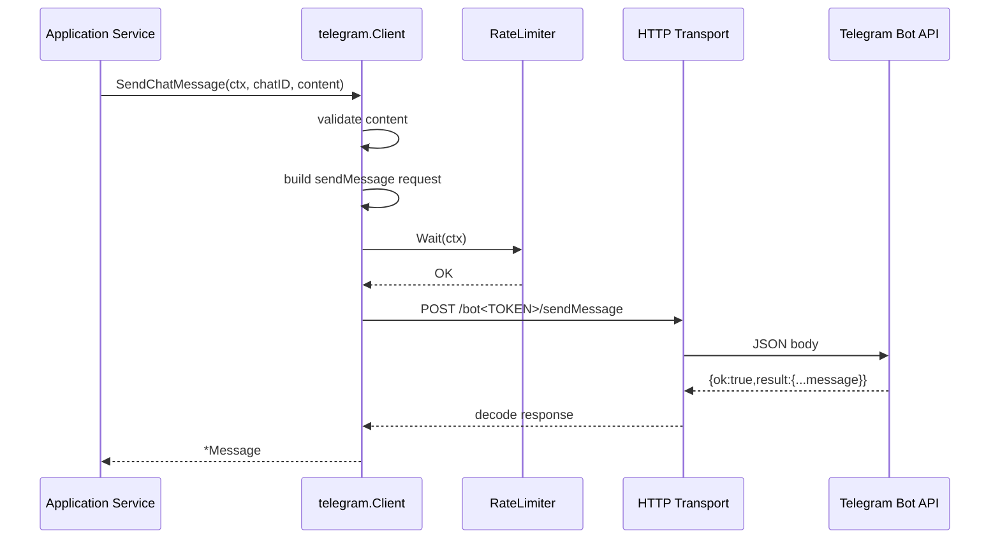
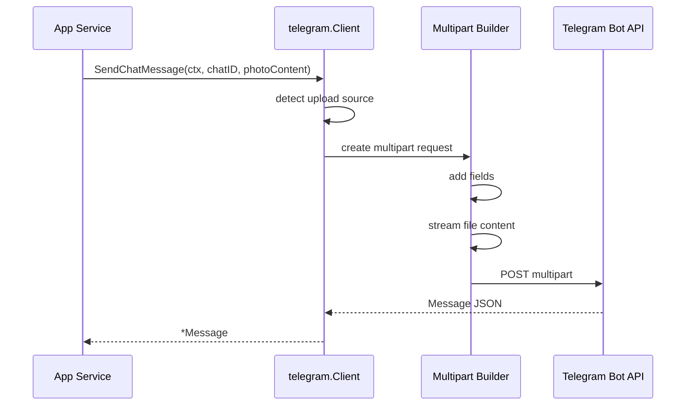
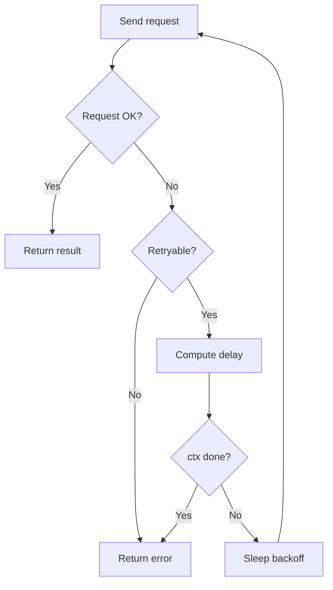
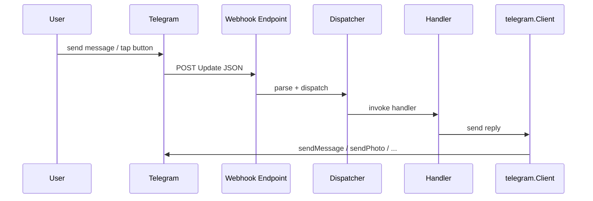
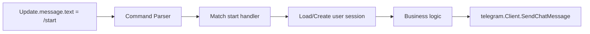
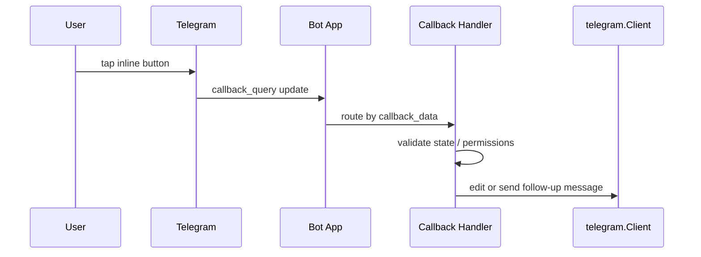

# Telegram Bot Framework Flow

> Documentation style: GitHub Flavored Markdown  
> Intended for repositories published on GitHub and compatible with MIT-licensed projects.

## 1. Mục tiêu tài liệu

Tài liệu này mô tả **flow hoạt động end-to-end** của một Telegram Bot framework dựa trên package `telegram` hiện có trong repository này.

Phân biệt rõ:

- **Đã có trong code hiện tại**: outbound client để gửi message/media qua Telegram Bot API.
- **Định nghĩa framework đầy đủ**: thêm inbound update handling, dispatcher, command routing, callback handling, persistence, queue, middleware, observability.

Nói ngắn gọn:

- Package `telegram` hiện tại là **transport + client layer**.
- Full framework là **runtime orchestration layer** bao quanh transport đó.

## 2. Các tác nhân trong hệ thống

- **User**: người dùng Telegram tương tác với bot.
- **Telegram Client App**: app Telegram trên mobile/desktop/web.
- **Telegram Bot API**: HTTP API chính thức của Telegram.
- **Bot Runtime**: ứng dụng Go của bạn.
- **Inbound Adapter**: nhận update qua webhook hoặc polling.
- **Dispatcher**: định tuyến update đến handler phù hợp.
- **Application Service**: nghiệp vụ của hệ thống.
- **Persistence Layer**: database lưu user/chat/session/state.
- **Outbound Client**: package `telegram` dùng để gửi message/media.

## 3. Tổng quan flow kiến trúc

## 4. Flow bootstrap khi ứng dụng khởi động

### 4.1 Mục tiêu

Khi service start, runtime cần hoàn thành các bước:

1. Load config.
2. Khởi tạo Telegram client.
3. Khởi tạo storage, logger, metrics, queue.
4. Chọn chế độ nhận update: webhook hoặc polling.
5. Đăng ký router/handler.
6. Start HTTP server hoặc polling loop.

### 4.2 Sequence

### 4.3 Kết quả

Sau bootstrap:

- outbound đã sẵn sàng gọi `Send`, `SendChat`, `SendMessage`, `SendBatch`
- inbound đã sẵn sàng nhận update
- runtime có thể chạy như một bot 2 chiều hoàn chỉnh

## 5. Flow outbound: gửi text message

### 5.1 Use case

Hệ thống nội bộ phát sinh event:

- đơn hàng mới
- cảnh báo hệ thống
- job background hoàn thành
- user vừa thao tác xong một command và bot cần phản hồi

### 5.2 Flow chi tiết

### 5.3 Mapping với code hiện tại

- Constructor: [client.go](/Users/mac/GolandProjects/smsTelegramPrj/telegram/client.go:71)
- Public send methods: [client.go](/Users/mac/GolandProjects/smsTelegramPrj/telegram/client.go:114)
- Request builder: [client.go](/Users/mac/GolandProjects/smsTelegramPrj/telegram/client.go:293)
- JSON request: [internal/http.go](/Users/mac/GolandProjects/smsTelegramPrj/telegram/internal/http.go:24)

## 6. Flow outbound: gửi media và upload file

### 6.1 Các kiểu nguồn file được hỗ trợ

`InputFile` hỗ trợ 4 kiểu nguồn:

- `FileID`: dùng file đã có trên Telegram
- `URL`: để Telegram tự fetch file từ Internet
- `Path`: upload file cục bộ từ disk
- `Data`: upload file từ buffer trong RAM

Định nghĩa nằm ở [content.go](/Users/mac/GolandProjects/smsTelegramPrj/telegram/content.go:83).

### 6.2 Quy tắc xử lý

- Nếu file là `FileID` hoặc `URL`: gửi request JSON thường.
- Nếu file là `Path` hoặc `Data`: gửi request `multipart/form-data`.
- Media group có thể trộn ảnh/video, hoặc thuần document, hoặc thuần audio.
- Không được trộn `audio` với `document` trong cùng một album.

### 6.3 Flow multipart upload

### 6.4 Lợi ích của stream upload

- Không cần load toàn bộ file lớn vào bộ nhớ thêm một lần nữa.
- Hợp với file từ disk.
- Dễ mở rộng cho thumbnail, attachment aliases, batch media.

## 7. Flow outbound: gửi media group

### 7.1 Mục tiêu

Media group là album 2-10 item qua `sendMediaGroup`.

### 7.2 Flow xử lý

1. Validate số lượng item.
2. Validate từng `MediaItem`.
3. Chuyển từng item sang `InputMedia*`.
4. Với item upload cục bộ, tạo `attach://media_i`.
5. Nếu có file upload, build multipart request.
6. Gửi request.
7. Telegram trả về `[]Message`.

### 7.3 Lưu ý nghiệp vụ

- Album trả về nhiều message, không phải một message.
- `SendMessage`/`SendChatMessage` hiện chỉ trả về **message đầu tiên** nếu content là media group.
- Nếu bạn cần đủ album, dùng `SendMediaGroup` hoặc `SendChatMediaGroup`.

## 8. Flow outbound: batch sending

### 8.1 Mục tiêu

`SendBatch` cho phép gửi nhiều item song song có kiểm soát.

### 8.2 Cách hoạt động

- Tạo worker pool với `BatchConcurrency`.
- Đưa index các item vào channel `jobs`.
- Mỗi worker lấy từng item và gọi send tương ứng.
- Kết quả được ghi vào `[]BatchResult` đúng theo thứ tự input.

### 8.3 Khi nào dùng

- gửi thông báo hàng loạt
- gửi nhiều chat khác nhau cùng lúc
- xử lý queue notification

### 8.4 Khi không nên dùng

- broadcast cực lớn chưa có sharding/queue
- khi bạn cần global throughput control tinh hơn
- khi cần transaction nghiệp vụ nhiều bước cho mỗi recipient

## 9. Flow retry, rate limiting và error handling

### 9.1 Retry flow

### 9.2 Khi nào request được retry

- network error
- HTTP 5xx
- Telegram flood / `429 Too Many Requests`

### 9.3 Retry delay

Thứ tự ưu tiên:

1. Nếu Telegram trả `retry_after`: dùng giá trị đó.
2. Nếu không: dùng `BaseDelay * 2^(attempt-1)`.
3. Nếu cấu hình `Jitter`: cộng jitter.
4. Không vượt quá `MaxDelay`.

### 9.4 Rate limit awareness

Client có pacing nhẹ phía client trước mỗi call.

Ý nghĩa:

- giảm burst quá mạnh
- giảm nguy cơ Telegram trả flood sớm
- an toàn hơn khi nhiều goroutine dùng chung một client

Đây là **client-side pacing**, không thay thế hoàn toàn queue hoặc distributed rate limiter nếu hệ thống lớn.

### 9.5 Error classification

Các nhóm lỗi chính:

- `invalid_token`
- `flood`
- `blocked`
- `chat_not_found`
- `forbidden`
- `unknown`

Khi triển khai production:

- `blocked`: nên mark recipient là inactive
- `chat_not_found`: cần rà soát mapping chat ID
- `invalid_token`: fail fast khi boot
- `flood`: retry theo `retry_after`

## 10. Flow inbound: webhook mode

### 10.1 Ý tưởng

Telegram chủ động `POST update` vào endpoint HTTPS của bạn.

### 10.2 Flow

### 10.3 Ưu điểm

- latency thấp
- ít poll vô ích
- hợp production public service

### 10.4 Nhược điểm

- cần public HTTPS endpoint
- cần xác thực nguồn webhook
- cần deploy/network setup cẩn thận

## 11. Flow inbound: polling mode

### 11.1 Ý tưởng

App của bạn gọi `getUpdates` theo vòng lặp để kéo update.

### 11.2 Flow

1. App gọi `getUpdates(offset, timeout)`.
2. Telegram giữ long-poll cho đến khi có update hoặc timeout.
3. App nhận danh sách update.
4. Cập nhật `offset = lastUpdateID + 1`.
5. Dispatcher route từng update.

### 11.3 Ưu điểm

- dễ chạy local/dev
- không cần public webhook

### 11.4 Nhược điểm

- scale kém hơn webhook
- cần loop/state offset ổn định
- không hợp multi-instance nếu chưa có coordination

## 12. Flow command handling

Ví dụ user gửi `/start`.

### 12.1 Các bước chuẩn

1. Parse update.
2. Xác định loại event: message, callback query, edited message, inline query.
3. Nếu là text bắt đầu bằng `/`, parse command.
4. Áp middleware:
   - auth
   - logging
   - metrics
   - panic recovery
   - throttling
5. Gọi handler.
6. Handler trả response hoặc side effect.
7. Outbound layer gửi message phản hồi.

## 13. Flow callback query từ inline keyboard

### 13.1 Bối cảnh

User bấm nút inline keyboard có `callback_data`.

### 13.2 Flow

### 13.3 Lưu ý thiết kế

- `callback_data` nên ngắn, ổn định, có version prefix.
- Không nhét payload quá lớn vào callback.
- Với state phức tạp, callback chỉ nên chứa key, còn dữ liệu nằm trong DB/cache.

## 14. Flow lưu chat ID và state hội thoại

### 14.1 Tại sao cần lưu `chat_id`

Trong thực tế, outbound notification ổn định nên dùng `chat_id`, không nên phụ thuộc username.

### 14.2 Flow đề xuất

1. User gửi `/start`.
2. Inbound handler lấy:
   - `user_id`
   - `chat_id`
   - `username`
3. Lưu vào DB.
4. Các service khác dùng `chat_id` để gửi.

### 14.3 State machine hội thoại

Với bot nhiều bước:

- state nên nằm ở persistence layer
- mỗi update đọc state hiện tại
- handler quyết định next state
- sau đó mới gửi reply

## 15. Flow graceful shutdown

Khi service dừng:

1. Ngừng nhận traffic mới.
2. Kết thúc polling loop hoặc unbind webhook handler.
3. Chờ inflight request hoàn tất theo timeout.
4. Flush logs/metrics nếu cần.
5. Đóng DB/cache/queue.

## 16. Flow observability

Mỗi request/send nên có:

- request ID / correlation ID
- method Telegram (`sendMessage`, `sendPhoto`, ...)
- target chat
- retry count
- latency
- result: success / failed / blocked / flood

Metrics nên có:

- total sends
- failed sends by kind
- retry count
- webhook latency
- handler latency
- queue lag nếu có async processing

## 17. Flow tích hợp production được khuyến nghị

### 17.1 Notification-only bot

- chỉ cần package `telegram`
- input đến từ business event
- không cần inbound routing phức tạp

### 17.2 Interactive bot

- cần full framework
- webhook hoặc polling
- dispatcher + middleware + handlers
- DB lưu state

### 17.3 Hybrid bot

- vừa nhận command
- vừa gửi notification chủ động
- đây là mô hình phổ biến nhất

## 18. Những điểm cần nhớ

- `telegram.Client` là **outbound transport client**, không tự poll update.
- Full bot framework phải có thêm inbound, dispatch, state, middleware, persistence.
- `chat_id` là định danh gửi tin ổn định nhất trong production.
- Retry chỉ xử lý transport/API tạm thời, không thay thế thiết kế queue.
- Rate limit client-side là lớp bảo vệ nhẹ, không phải distributed quota system.

## 19. Tài liệu liên quan

- Framework architecture: [ARCHITECTURE.md](/Users/mac/GolandProjects/smsTelegramPrj/telegram/docs/ARCHITECTURE.md)
- Source code client: [client.go](/Users/mac/GolandProjects/smsTelegramPrj/telegram/client.go)
- Source code content model: [content.go](/Users/mac/GolandProjects/smsTelegramPrj/telegram/content.go)
- Telegram Bot API: <https://core.telegram.org/bots/api>
